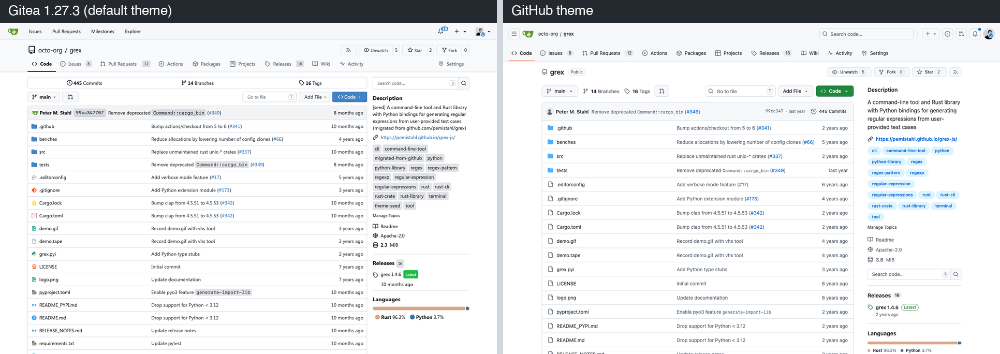
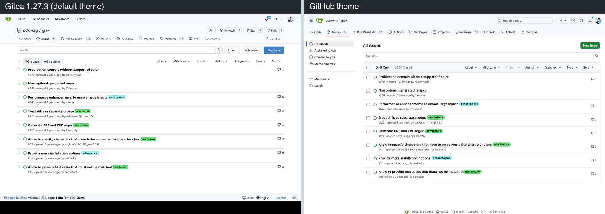
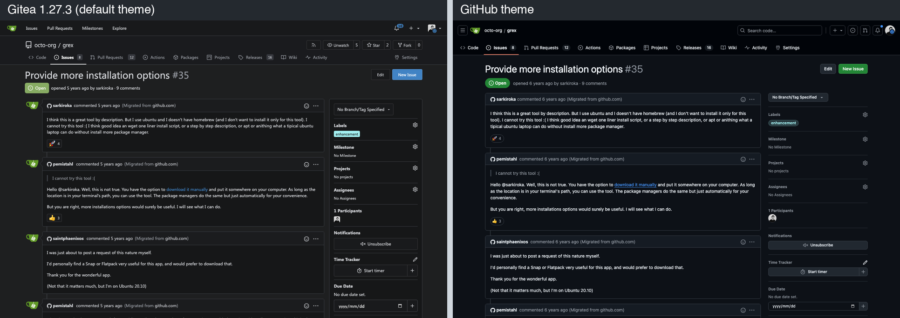
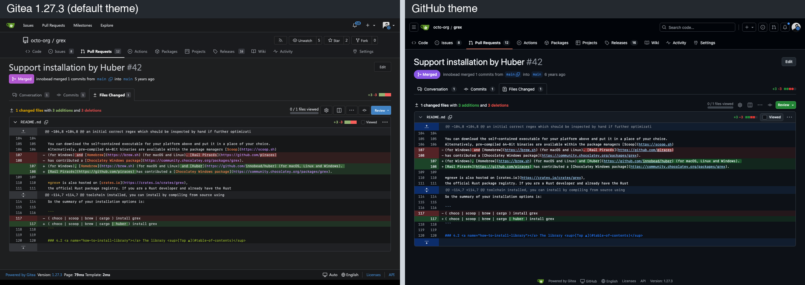
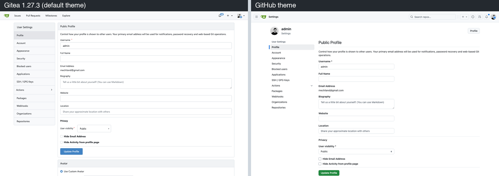

# gitea-theme-github

[](https://github.com/mechiland/gitea-theme-github/actions/workflows/release.yml)
[](LICENSE)

A GitHub look-and-feel theme for **Gitea 1.27.3**, in light, dark and auto (follows the OS color scheme).

It is built from GitHub's own open-source design system, not by recolouring Gitea:
- every color, size, radius, shadow, type and motion value comes from [Primer Primitives](https://primer.style/product/primitives/) (`@primer/primitives` 11.10.0);
- every icon is an [Octicon](https://primer.style/octicons/) (19.38.0);
- controls follow the Primer component specs.

No GitHub logos or trademarks are shipped, and the Gitea logo stays.

| Theme | Name in *Settings → Appearance* | Color scheme |
|---|---|---|
| `github-auto` | **GitHub** | follows the OS (light/dark) |
| `github-light` | GitHub Light | light |
| `github-dark` | GitHub Dark | dark |

## Screenshots

Left: Gitea 1.27.3 default theme. Right: this theme. Same instance, same data.

**Repository home**


**Issue list**


**Issue conversation (dark)**


**Pull request diff (dark)**


**Settings**


## Install

The theme is a set of files for Gitea's custom directory (`CUSTOM_PATH`, `$GITEA_CUSTOM`). You don't change or rebuild Gitea itself.

| Deployment | Custom directory |
|---|---|
| Official Docker image (`gitea/gitea`, `docker.gitea.com/gitea`) | `/data/gitea` inside the container (the `/data` volume) |
| Binary / systemd | `$GITEA_WORK_DIR/custom` (default `/var/lib/gitea/custom`), or the `CUSTOM_PATH` shown in *Site Administration → Configuration* |

### 1. Download the release package

Take `gitea-theme-github-<version>-gitea1.27.3.tar.gz` (or `.zip`) from [Releases](https://github.com/mechiland/gitea-theme-github/releases), or the `gitea-theme-github` artifact of the latest [CI run](https://github.com/mechiland/gitea-theme-github/actions).

It contains:

```
public/assets/css/theme-github-{auto,light,dark}.css   the themes (one self-contained file each)
public/assets/img/svg/*.svg                           Octicons 19.38 upgrade + Octicon replacements for non-Octicon icons
templates/**                                          GitHub-only template blocks (other themes render Gitea's upstream HTML)
INSTALL.md, LICENSE, NOTICE
```

### 2. Extract it into the custom directory

**Docker (docker compose, volume `./gitea:/data`):**

```bash
tar -xzf gitea-theme-github-*-gitea1.27.3.tar.gz -C ./gitea/gitea
```

**Binary / systemd:**

```bash
sudo tar -xzf gitea-theme-github-*-gitea1.27.3.tar.gz -C /var/lib/gitea/custom
sudo chown -R git:git /var/lib/gitea/custom
```

### 3. Enable the themes in `app.ini`

```ini
[ui]
; keep the themes you already offer and add the three GitHub ones
THEMES = gitea-auto,gitea-light,gitea-dark,github-auto,github-light,github-dark
; optional: make it the default for everyone
DEFAULT_THEME = github-auto
```

With the Docker image, you can set the same values with environment variables instead:

```yaml
services:
  server:
    image: docker.gitea.com/gitea:1.27.3
    environment:
      - GITEA__ui__THEMES=gitea-auto,gitea-light,gitea-dark,github-auto,github-light,github-dark
      - GITEA__ui__DEFAULT_THEME=github-auto
    volumes:
      - ./gitea:/data
```

### 4. Restart Gitea once, then pick the theme

```bash
docker compose restart server        # or: sudo systemctl restart gitea
```

Choose **GitHub** under *Settings → Appearance*. Anonymous visitors get `DEFAULT_THEME`.

New theme files and icons are read at startup, so only this first install needs a restart. After that, updating the CSS takes effect on reload. Template changes can be hot-reloaded with `gitea manager reload-templates`.

### Notes

- **Gitea version:** the templates are copies of Gitea **1.27.3** templates with added GitHub-only blocks. Re-check them when you upgrade Gitea. The CSS alone still works without the templates, but you lose the cascade layering (see [ARCHITECTURE.md §3](ARCHITECTURE.md)), the GitHub-style header and a few page structures.
- **If you already override templates:** if you override one of the shipped templates yourself (e.g. `base/head_style.tmpl`), merge the `{{if StringUtils.HasPrefix … "github-"}}` blocks by hand.
- **Icons are global:** the SVG icons replace Gitea's icons for every theme. They depict the same things, drawn as Octicons.
- **Browser support:** Chrome/Edge 112+, Safari 16.5+, Firefox 121+. The theme uses `@layer`, `:has()` and CSS nesting.
- **Uninstall:** delete the files you extracted, remove the themes from `[ui] THEMES`, and restart.

## Build from source

```bash
git clone https://github.com/mechiland/gitea-theme-github && cd gitea-theme-github
npm ci
npm run lint       # no literal colors outside the token layer, type/radius/shadow from tokens, selector ownership
npm run build      # → dist/theme-github-{auto,light,dark}.css (budget: ≤ 300 KB each, minified)
npm run package    # → dist/gitea-theme-github-<version>-gitea1.27.3.{zip,tar.gz} (the drop-in package above)
```

Where things live:
- `src/tokens/`: Primer tokens and the Gitea-variable → Primer-token map.
- `src/<folder>/`: one folder per surface (foundation, controls, overlays, navigation, data-display, code, markdown, pages/*, dark). Each compiles into its own CSS `@layer`.
- `templates/`: the GitHub-only template overrides.
- `src/icons/`: the Octicon icon overrides.

Design, cascade model, ownership rules and template policy are in [ARCHITECTURE.md](ARCHITECTURE.md).

Tooling used during development, against a local Gitea described in [docs/CONTEXT.md](docs/CONTEXT.md):
- `tools/seed/`: idempotent seed data.
- `tools/shoot/`: Playwright screenshots and audits (off-palette colors, unresolved variables, non-Octicon icons, layout shift), github.com reference capture, pixel diff, CSS coverage, and a functional smoke test.
- `tools/judge/`: blind A/B pairs.

### CI / releases

[`.github/workflows/release.yml`](.github/workflows/release.yml) runs on every push and pull request:
1. lint;
2. build;
3. package;
4. upload the package as a workflow artifact.

Pushing a tag `v*` builds with `--strict`, which enforces the 300 KB budget, and publishes a GitHub Release with the `.zip` and `.tar.gz` attached:

```bash
npm version patch && git push --follow-tags
```

## Status

This is a work in progress. Current numbers, open issues, budgets and pinned versions are in [docs/STATUS.json](docs/STATUS.json).

Every page was reviewed by independent critics that compare screenshots and measurements against github.com. The latest whole-site score is about 8.4 of 10 (light and dark) and 8.1 (mobile) across 101 pages.

The remaining visible differences are mostly Gitea's own features, wording and page structure, which a theme should not remove.

## License

[MIT](LICENSE).

Includes or derives from Primer Primitives, Octicons and Primer CSS (MIT, © GitHub Inc.); see [NOTICE](NOTICE). "GitHub" in the theme name describes the visual style. This project is not affiliated with GitHub.
